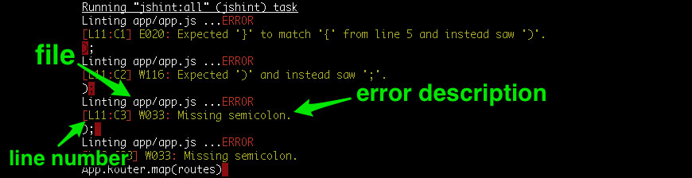
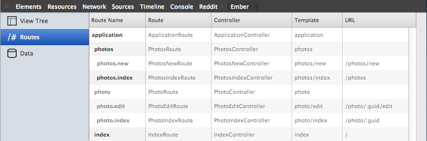

<span id="introduction"></span>

When I started learning Ember.js, I spent a lot of time trying different persistence layers. In the process, I tried *Ember Data*<span class="small"> (at the time it was at Revision 13),</span> *Ember Model* and *EPF*. Without a solid understanding of the Ember architecture it was difficult to tell where Ember stopped and the persistance layer began. When something wasn't working, I couldn't be sure if my code had a bug, if I was using the library incorrectly or if there was a bug in the library that I was using. I decided that the best way for me to learn was to create a simple CRUD app that didn't use any of the existing persistance layers. 

I created an Ember app that does basic CRUD functionality and stores the created entries in HTML5 localStorage. This app is **work in progress** and I intend to improve it over time. You can checkout the <a href="https://github.com/taras/ember-crud-example#todo" target="_blank">README</a> to see what's completed.

<div class="btn-group mbl mtm"><a href="app/" class="btn btn-success">Try the app</a><a href="app/tests/" class="btn btn-info">Run tests</a><a class="btn btn-warning" href="https://github.com/taras/ember-crud-example#todo" target="_blank">TODOs</a></div>

This article will walk you through the *Ember CRUD Example* app to help you understand how Ember works and how to organize your project.

<span id="start"></span>
### Getting Started

To start, 

1. fork the [Ember CRUD Example](https://github.com/taras/ember-crud-example) repository on GitHub
2. clone your fork to your computer
3. in your working directory
  1. install Node.js modules with ```npm install``` ( assuming you have npm installed, if not [Introduction to npm](http://howtonode.org/introduction-to-npm) )
  2. install Bower components with ```bower install``` ( assuming you have bower installed, if not ```npm install -g bower```)
  3. install Grunt with ```npm install -g grunt-cli``` if you don't already have it installed
4. Verify that everything works
  1. start the dev server with ```grunt server```
  2. go to <a href="http://localhost:8000" target="_blank">http://localhost:8000</a>
  3. your app should look like the <a href="app/index.html">demo</a>

<div class="dialog dialog-warning">If you're having difficulty with the setup, checkout the <a href="support.html">support page</a> or talk to me via <a href="https://clarity.fm/tarasm">Clarity.fm</a></div>

Going forward, I'll refer to files in your working directory. 

<span id="ember-app-kit"></span>
### Ember App Kit

I started off writing the entire project in 2 files(app.js and index.html), but I wanted my code to look as close to a real project as possible, so I refactored my code to use *Ember App Kit*. *Ember App Kit* includes [Grunt](#grunt), [JSHint](#jshint), [QUnit with Karma](#qunit) test runner and [ECMAScript 6 modules](#ecmascript6).

<span id="grunt"></span>
#### Grunt

Grunt is a task runner that is used to automate repetitive actions that occur during development. Tasks are configurd via the **/Gruntfile.js** file (look in the root of your working directory). Ember App Kit comes preconfigured with a comprehensive set of tasks. Here is a list of the ones that you'll use most frequently.

* ```grunt``` - build your app and run the tests.
* ```grunt server``` - run the server in development mode and auto-rebuilding when files change
* ```grunt test:server``` - run the server in test mode and re-run the tests when files change

For a complete list of tasks checkout the **/Gruntfile.js**.

<span id="jshint"></span>
#### JSHint

JSHint reports common errors in your code. In *Ember App Kit*, JSHint is used as a Grunt task that runs when you run ```grunt```, ```grunt server``` or any of the ```grunt test``` tasks. You can also run it manually with ```grunt jshint```. 

When any of these commands run, you'll see a line that starts with **Running "jshint:all" (jshint) task**



<span id="qunit"></span>
#### QUnit & Karma

QUnit is the testing framework that is recommended by the Ember.js Core Team. Karma is a test runner that allows us to run tests in the browser or headless via PhantomJS.

Here are some of the ways that you can execute the tests:

* ```grunt test``` runs the tests one time.
* ```grunt test:server``` opens Karma test runner and re-runs the tests everytime a file changes
* in the browser, go to [http://localhost:8000/tests/](http://localhost:8000/tests) directory

<span id="acmascript6"></span>
#### ACMAScript 6 Modules

Ember provides namespacing which allows you to keep your app's classes out of the global scope. Modules take this a step further by requiring you to explicitely import objects into your scope. *ACMAScript 6 modules* is a features that's coming in the next version of JavaScript, but you can use them today with the help of *es6-module-transpiler*.  You don't have to know how it works, but you need to know how to use it.

Every module can import objects from other modules and export modules to make them available to other modules. A good example of this is in **/app/routes/application.js**.

At the top of the file, we import Photo model from 'ember-crud-example/models/photo' with ```import Photo from 'ember-crud-example/models/photo';```. This makes the *Photo* model from *ember-crud-example/models/photo* module available within the *application* module. 

In turn, *application* module exports *ApplicationRoute* to make it available to other modules with ```export default ApplicationRoute;```

<div class="dialog dialog-warning">You don't have to set your classes into the App namespace. ( ie. ~~```App.ApplicationRoute = Ember.Route.extend({}); ```~~ ), but you have to import your *App* from the *app* module with ```import App from 'ember-crud-example/app';```.
</div>

**ember-crud-example** is the namespace and it's configured via the *namespace* property in **/package.json**.

<span id="routes"></span>
### Routes

<div class="dialog dialog-warning">If you're not sure where to start planning your application, start with routes.</div>

Routes are the entry point to your application. The example app allows the user to upload photos and add title and description to each photo. So we start with urls where the user will be able to perform these actions.

* **/photos/** - show a list of photos
* **/photos/new** - add a new photo
* **/photo/:id** - see an existing photo
* **/photo/:id/edit** - edit an existing photo

Ember App Kit has a separate file where the routes are defined, look in **/app/routes.js**.

Ember has two different kinds of routes: resources and nested routes. Resources can nest other resources and routes, and are added with ```this.resource( name, options, fn )```. In the example app, **photos** and **photo** are resources. Nested routes are nested into resources and are added with ```this.route( name, options )```. Nested resources **can not** have other resources or endpoints under them. 

Ember's class naming conventions can be tricky especially around the route class names. If you're not sure what class name Ember expects, open Route tab in the Ember Inspector. 



#### ApplicationRoute

**ApplicationRoute** is the brain of the example app. It listens for important events that happen in the application and handles them appropriately.

<div class="dialog dialog-warning">When starting, handle actions that are triggered by your templates in the application route. Later, when you need more granular control, you can refactor your app to handle them closer to the template ( ie. a nested route, a controller or a view )</div>

In the example app, all actions are hanled in **/app/routes/application.js**. **ApplicationRoute** is also responsible for handling transitions from one route to another.

#### PhotosRoute

**PhotosRoute**(in **/app/routes/photos.js**) shows a list of uploaded photos and nests **NewPhotosRoute**(in **/app/routes/photos/new.js**).

<div class="dialog dialog-warning">Ember expects nested routes to be rendered inside of its resource's template. This means that when accessing a nested route, by default, both the resource template and the nested route template are rendered.</div>

<div class="dialog dialog-danger">Nested templates are rendered into an ```{{outlet}}``` in the resource's template. If the resource's template doesn't have an ```{{outlet}}``` then the nested route's template will **not be** rendered.</div>

In the example app, we want to show the new photo form when on the **NewPhotosRoute** or list of photos when on the **PhotosRoute**. This means that the **PhotosRoute** exists in 2 states: the list or the form. The template for **PhotosRoute**, located in **/app/templates/photos.hbs** has ```{{if isOpenNew}}``` is true then show ```{{outlet}}```, otherwise show the list. 