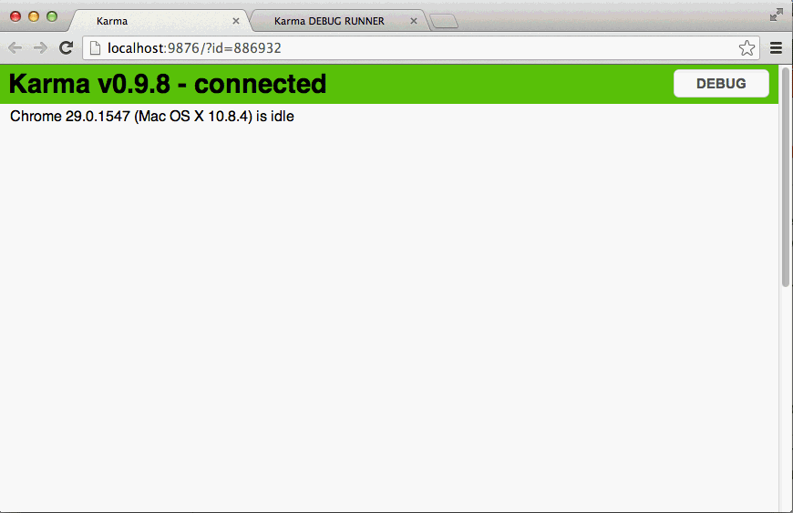

Most Ember demos show all of the JavaScript and HTML in one file. This is convenient for demo purposes but that's not how real applications are written. When writing large applications, you need a tight workflow that's well integrated with your toolset to make sure that you make the most the time that you spend writing code. You could try to develop this workflow, which could take months or you could start your project with *Ember App Kit*.

*Ember App Kit* is a well integrated toolset that you can use as a foundation for your project. Out of the box, *Ember App Kit* includes *Grunt* - task runner, *JSHint* - linter, *QUnit* - testing framework, *Karma* - test runner, *ECMAScript 6* modules and *Bower* - client side package manager. 

Development of *Ember App Kit* is lead by *[Stefan Penner](https://github.com/stefanpenner)* and recently received blessings from the Ember Core Team. Its being positioned as the default Ember project layout and might eventually grow into an executable for creating and managing Ember projects.

Like many things with Ember, Ember App Kit is under active development and continues to grow and improve. You can watch the [Ember App Kit on GitHub](https://github.com/stefanpenner/ember-app-kit) to stay up to date on its developments and learn about evolution of the Ember project toolset.

<span id="installation"></span>
### Installation

At the momement, there is no *easy* way to install *Ember App Kit*. The best that I found is to clone the *Ember App Kit* repository to your machine and clone from your local repo whenever you're ready to start a new project. 

Here is how that might look on Mac OS X:

1. ```cd ~/Repositories``` go into your Repositories directory 
2. ```git clone https://github.com/stefanpenner/ember-app-kit```

To create a new project in your Repositories directory

1. ```git clone ember-app-kit my-project``` your project 
2. ```cd my-project``` go into my-project directory
3. ```rm -r .git``` remove .git directory that contains history of ember-app-kit project
4. ```git init``` initialize a new git repo for your project

Your newly created project contains all of the configuration files that enable the *Ember App Kit* workflow but it doesn't include any of the [Node.js](http://nodejs.org/) packages that are required to use these configuration files.

If you don't already have *Node.js* installed, you can install it from [Node.js](http://nodejs.org/) or with a package manager ( like [Homebrew](http://brew.sh/) on Mac OS X ).

With *Node.js* installed, you can globally install required utilities by running the following commands:

1. ```npm install -g grunt-cli``` to install Grunt command line tool
2. ```npm install -g bower``` to install Bower

Finally, you can download your project dependancies by running NPM's and Bower's install commands in your project's root directory:

1. ```npm install``` install NPM modules
2. ```bower install``` install Bower modules

<div class="dialog dialog-warning">As Ember App Kit evolves, you might start to wonder how to keep your project layout updated. This question doesn't have a good answer yet, but you can watch this [issue](https://github.com/stefanpenner/ember-app-kit/issues/24) for updates.</div>

<span id="how-to-use"></span>
### How to use Ember App Kit?

Using *Ember App Kit* is 50% what you do and 50% how you do it. When working with *Ember App Kit* what you do is run *Grunt* tasks. To take advantage of the tools that come with *Ember App Kit*, you have to follow conventions that are introduced by these tools.

<span id="grunt"></span>
### Grunt

Grunt is a task runner that's used to automate repetitive actions that occur during development. Tasks are configurd via the **Gruntfile.js** file (look in the root of your project's directory). *Ember App Kit* comes preconfigured with a comprehensive set of tasks. Here is a list of the ones that you'll use most frequently.

* ```grunt``` - build your app and run the tests.
* ```grunt server``` - run the server in development mode and automatically rebuild when files change
* ```grunt build:debug``` - build your app in debug mode and output the result tmp/public directory
* ```grunt server:dist``` - build your app, minify all JS and CSS and output to tmp/public directory

For a complete list of tasks checkout the **/Gruntfile.js**.

<span id="jshint"></span>
### JSHint

JSHint reports common errors in your code. In *Ember App Kit*, JSHint is used as a Grunt task that runs when you run ```grunt```, ```grunt server``` or any of the ```grunt test``` tasks. You can also run it manually with ```grunt jshint```. 

When any of these commands run, you'll see a line that starts with **Running "jshint:all" (jshint) task**


<div class="dialog dialog-warning">*JSHint* will complain about an unknown function if you try using a class or a function from an external plugin. You can tell JSHint to ignore such functions by adding them to **predef** array in the **.jshintrc** file in your project's root directory.</div>

<span id="qunit"></span>
### QUnit

QUnit is the testing framework that is recommended by the Ember.js Core Team. You can run QUnit tests on your app by going to [http://localhost:8000/tests](http://localhost:8000/tests). *Ember App Kit* comes preconfigured for running *unit* and *integration* tests.

Read the [Integration Testing](http://emberjs.com/guides/testing/integration/) guide to learn more about testing Ember applications.

<span id="karma"></span>
### Karma

Karma is a test runner that allows to run tests in the browser or headless via PhantomJS. You can start a test server with ```grunt test:server``` that will automatically re-run tests everytime that a file in your project changes. Test server will open a browser window that can use to debug your tests.



You can debug your tests using the console and breakpoints.

Here are testing related tasks that you might run during a project

* ```grunt test``` runs the tests one time.
* ```grunt test:server``` opens Karma test runner and re-runs the tests everytime a file changes
* ```grunt test:ci``` runt tests in PhantomJS when using for continious integration.

<span id="ecmascript6"></span>
### ECMAScript 6 Modules

Ember provides namespacing which allows you to keep your app's classes out of the global scope. Modules take this a step further by requiring you to explicitely import objects into your scope. *ECMAScript 6 modules* is a features that's coming in the next version of JavaScript, but you can use them today with the help of *es6-module-transpiler*.  You don't have to know how it works, but you need to know how to use it.

<div class="dialog dialog-info">Every module can import objects from other modules and export modules to make them available to other modules.</div>

For example:

in **app/routes/photo/new.js**
```
import Photo from 'appkit/models/photos'; // import Photo model

var PhotoNewRoute = Ember.Route.extend({
  model: function() {
    return Photo.create({
      title: "Beautiful photo"
    });
  }
}
});

export default PhotosNewRoute; // export PhotosNewRoute
```

in **app/models/photos.js**
```
import Model from 'appkit/models/index';

var Photo = Model.extend({
  title: ""
});

export default Model;
```

<div class="dialog dialog-warning">You don't have to set your classes into the App namespace. ( ie. ~~```App.ApplicationRoute = Ember.Route.extend({}); ```~~ ), but you have to import your *App* from the *app* module with ```import App from 'appkit/app';```.
</div>

<span id="bower"></span>
### Bower

Bower is a package manager for client side libraries. It allows you to keep track external JavaScript libraries that you're using in your project. It's the easiest way to add any JavaScript or CSS library from GitHub to your project. 

Let's say you wanted to add *Twitter Bootstrap* to your project. Run ```bower install bootstrap --save``` and the *Twitter Bootstrap* package will be downloaded and extracted to your project's **vendor** directory. 

Here is a list of commands that you might want to use:

* ```bower install``` install all packages in **bower.json**
* ```bower install --save <packagename>``` install a package and add it to **bower.json**
* ```bower search``` show a list of all available packages
* ```bower search <keyword>``` show a list of packages that match keyword
* ```bower install git+<git_repo_url>``` install a package from GitHub
* ```bower install git+<git_repo_url>#tag``` install a package from GitHub at specific tag ( can be revision, branch or tag )

### Conclusion

*Ember App Kit* is a Swiss Army knife for Ember development. Every tool has its use and every tool will save you a ton of time when used appropriately. A solid development workflow is a must for any serious Ember developer. *Ember App Kit* is a strong foundation for an ambitious Ember project.