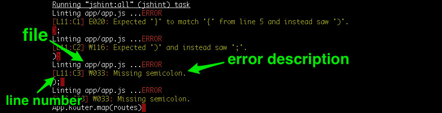

Most Ember demos show all of the JavaScript and HTML in one file. This is convinient for demo purposes but that's not how applications are written. When writing large applications, you need a tight workflow that's well integrated with your toolset to make sure that you make the most the time that you spend writing code. You could try to develop this workflow, which could take months or you could start your project with Ember App Kit.

*Ember App Kit* is a well integrated toolset that you can use as a foundation for your project. Out of the box, *Ember App Kit* includes *Grunt* - task runner, *JSHint* - linter, *QUnit* - testing framework, *Karma* - test runner, *ECMAScript 6* modules and *Bower* - client side package manager. 

Development of *Ember App Kit* is lead by *[Stefan Penner](https://github.com/stefanpenner)* and recently received blessings from the Ember Core Team. Its being positioned as the default Ember project layout and might eventually grow into an executable for creating and managing Ember projects.

Like many things with Ember, Ember App Kit is under active development and continues to grow and improve. You can watch the [Ember App Kit on GitHub](https://github.com/stefanpenner/ember-app-kit) to stay up to date on its developments and learn about evolution of the Ember project toolset.


<span id="grunt"></span>
### Grunt

Grunt is a task runner that is used to automate repetitive actions that occur during development. Tasks are configurd via the **/Gruntfile.js** file (look in the root of your working directory). Ember App Kit comes preconfigured with a comprehensive set of tasks. Here is a list of the ones that you'll use most frequently.

* ```grunt``` - build your app and run the tests.
* ```grunt server``` - run the server in development mode and auto-rebuilding when files change
* ```grunt test:server``` - run the server in test mode and re-run the tests when files change

For a complete list of tasks checkout the **/Gruntfile.js**.

<span id="jshint"></span>
### JSHint

JSHint reports common errors in your code. In *Ember App Kit*, JSHint is used as a Grunt task that runs when you run ```grunt```, ```grunt server``` or any of the ```grunt test``` tasks. You can also run it manually with ```grunt jshint```. 

When any of these commands run, you'll see a line that starts with **Running "jshint:all" (jshint) task**



<span id="qunit"></span>
### QUnit

QUnit is the testing framework that is recommended by the Ember.js Core Team.

* in the browser, go to [http://localhost:8000/tests/](http://localhost:8000/tests) directory

<span id="karma"></span>
### Karma

Karma is a test runner that allows us to run tests in the browser or headless via PhantomJS.

* ```grunt test``` runs the tests one time.
* ```grunt test:server``` opens Karma test runner and re-runs the tests everytime a file changes

<span id="ecmascript6"></span>
### ECMAScript 6 Modules

Ember provides namespacing which allows you to keep your app's classes out of the global scope. Modules take this a step further by requiring you to explicitely import objects into your scope. *ECMAScript 6 modules* is a features that's coming in the next version of JavaScript, but you can use them today with the help of *es6-module-transpiler*.  You don't have to know how it works, but you need to know how to use it.

Every module can import objects from other modules and export modules to make them available to other modules. A good example of this is in **/app/routes/application.js**.

At the top of the file, we import Photo model from 'ember-crud-example/models/photo' with ```import Photo from 'ember-crud-example/models/photo';```. This makes the *Photo* model from *ember-crud-example/models/photo* module available within the *application* module. 

In turn, *application* module exports *ApplicationRoute* to make it available to other modules with ```export default ApplicationRoute;```

<div class="dialog dialog-warning">You don't have to set your classes into the App namespace. ( ie. ~~```App.ApplicationRoute = Ember.Route.extend({}); ```~~ ), but you have to import your *App* from the *app* module with ```import App from 'ember-crud-example/app';```.
</div>

**ember-crud-example** is the namespace and it's configured via the *namespace* property in **/package.json**.

<span id="bower"></span>
### Bower