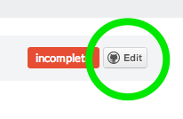

<div class="dialog dialog-success">Ember Sherpa was created to be a ***concise*** development companion for developers who are writing apps with Ember.js.</div>

#### Introduction

The easiest way to contribute is to either edit content on GitHub or [create an issue](https://github.com/taras/embersherpa/issues/new).
<div class="alert alert-warning">You can't create pages via GitHub</div>
<div class="thumbnail pull-right"><p class="dialog">Pages that are designed to be edited by the community have an Edit button in top right corner.</p></div>
For greater flexibility, you can form the project on GitHub and create a pull request.

#### Introduction to Wintersmith

* Wintersmith is a static site generator that we're using to generate Ember Sherpa
* it generates pages from files in **/contents/** directory
* each page of the site is an index.md file in a directory
* each page has metadata that's used to configure Wintersmith
* directory name is used as the url for the page
* diferent kinds of pages have different metadata
* ```title``` & ```template``` meta properties are common to all page types
* Learn more on [Wintersmith.io](http://wintersmith.io)

#### Content Guide

* keep verbosity to a minimum
* do your best to summarize and not go into details
* links to detailed explanations in your blog or else where

#### The Cheatsheet

* [/cheatsheet/](/cheatsheet/) is dynamically generated from content in [/contents/cheatsheet/](https://github.com/taras/embersherpa/tree/master/contents/cheatsheet) directory
    * each item in the cheatsheet is a directory in **/contents/cheatsheet/** with index.md
    * the directory name becomes the url of the item
* page hierarchy
    * directories in **/contents/cheatsheet/** are methods
    * sub-directories are properties

#### The stack

- [Flat UI](http://designmodo.github.io/Flat-UI/) on top of [Twitter Bootstrap 2.3.2](http://getbootstrap.com/2.3.2/)
- [Typeahead.js](http://twitter.github.io/typeahead.js/) used for search
- [Wintersmith](http://wintersmith.io/) used to generate html from content structure
- Templates are build with [Jade](http://jade-lang.com/reference/)
- Content is in [GitHub Style Markdown](https://help.github.com/articles/github-flavored-markdown)
- [Several custom built](https://github.com/taras/embersherpa/tree/master/plugins) Wintersmith plugins written in CoffeeScript
- [Grunt](http://gruntjs.com/) for automating tasks
- [Ember.js](http://emberjs.com/) only used to made writing JS in the browser easier ( for now )
- [Qunit](http://qunitjs.com/) used for running tests
- [Highlight.js](http://softwaremaniacs.org/soft/highlight/en/) library and [Highlight.js Node module](https://npmjs.org/package/highlight.js) for code highlighting

