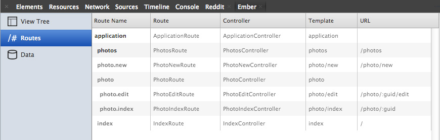

*Ember Data* is one of the most ambitious undertakings in recent JavaScript history. It carries the promise of a persistance library that makes it easy to build large browser applications that interact with diverse APIs. *Ember Data* is evolving quickly as the Ember Core Team experiments and iterates the library to create a generalized solution that will work for many use cases. These changes introduce code with kinks that haven't been ironed out yet. When using *Ember Data* developers often find themselves digging into the library to look where the problem originates.

Digging into *Ember Data* source code is easier for experienced Ember developers who are familiar with *Ember Data*'s history and Ember community. For a beginner, who is building a small browser app this can be extremely frustrating because its difficult to find the source of the problem. Innevitably, beginners waste days trying to figure out how to get their apps to make simple requests to their non conventional APIs. 

This article was written as an alternative to that experience. The goal of this article is to help you undestand Ember architecture and allow you to buid simple apps without relying on *Ember Data*.

There will come a day when *Ember Data* is a rock solid library that is easier to use than writing your own AJAX requests. Until that day, learn Ember architecture and roll your own persistance layer. This will give you the added bonus of understanding how *Ember Data* ties into *Ember* and what problems it tries to solve for you. 

This articles walks you through creating a CRUD app without *Ember Data* to give you a better understanding of Ember architecture.

<div class="btn-group mbl mtm"><a href="app/" class="btn btn-success">Try the app</a><a href="app/tests/" class="btn btn-info">Run tests</a><a class="btn btn-warning" href="https://github.com/taras/ember-crud-example#todo" target="_blank">GitHub</a></div>

[h3]Application[/h3]

The Ember CRUD Example app does basic CRUD functionality and stores the created entries in HTML5 localStorage.

Create an app instance and configure it to log useful information.

```javascript
// log binding activities
Ember.LOG_BINDINGS = true;

var App = Ember.Application.create({
  // log when Ember generates a controller or a route from a generic class
  LOG_ACTIVE_GENERATION: true,
  // log when Ember looks up a template or a view
  LOG_VIEW_LOOKUPS: true, 
  // render the application in jQuery("#ember-crud-example")
  rootElement: "#ember-crud-example"
});
```

[h3]Routes[/h3]

[info]Routes is a good place to start planning your application. If you're not sure where to start, start with routes.[/info]

The example app allows the user to upload photos and add title and description to each photo. So we start with urls where the user will be perform these actions.

```javascript
App.Router.map(function(){
  // list of all uploaded photos
  this.resource('photos',     {path:'/photos' }); 
  // form to allow you upload new photo
  this.resource('photo.new',  {path:'/photo/new'});
  // view an existing photo
  this.resource('photo',      {path:'/photo/:guid'}, function(){
    // edit an existing photo
    this.route('edit');
  });
})
```

Ember has two different kinds of routes: resources and nested routes. Resources can nest other resources and routes, and are added with ```this.resource( name, options, fn )```. Nested resources **can not** have other resources or routes under them and are added with ```this.route( name, options )```. 

[warning]Ember expects nested routes to be rendered inside of its parent template. It also assumes that the model returned by the parent is sufficient for rendering the nested route. If you want the router to load models for the nested route every time, then you have to make it a resource. This is why "photo.new" is a resource and not a route.[/warning]

Ember's class naming conventions can be tricky especially around the route class names. If you're not sure what class name Ember expects, open Route tab in the Ember Inspector. 



[h4]ApplicationRoute[/h4]

**ApplicationRoute** is the brain of your app. It listens for important actions that happen in the application and handles them appropriately.

[info]When starting, handle actions in the application route. Later, when you need more granular control, you can refactor your app to handle them deeper in your app.[/info]

In the example app, all actions are handled in **ApplicationRoute**. It is also responsible for handling transitions from one route to another.

If you look at the **actions** property in **ApplicationRoute**, you can get a birds eye view of all of the actions that are handled by this application. **edit**, **create**, **update** and **remove** are the CRUD operations. They're responsible for updating the persistence layer. I created a simple HTML5 localStorage based persistence layer with a simple API to make it clearer what happens when the CRUD operations are performed.

```javascript
App.ApplicationRoute = Ember.Route.extend({
  actions: {
    goToNewPhoto: function () {
      this.transitionTo( 'photo.new' );
    },
    goToPhoto: function( model ) {
      this.transitionTo( 'photo', model );
    },
    edit: function( model ) {
      this.transitionTo( 'photo.edit', model.copy() );
    },
    create: function( model ) {
      this.storage.create( model );
      this.transitionTo( 'photos' );      
    },
    update: function( model ) {
      this.storage.update( model );
      this.transitionTo( 'photos' );
    },
    remove: function( model ) {
      this.storage.remove( model );
    },
    cancel: function( model ) {
      Ember.run( model, "destroy" );
      this.storage.refresh(App.Photo);
      this.transitionTo( 'photos' );      
    }
  }
});
```

[h4]IndexRoute[/h4]

**IndexRoute** is displayed when the user accesses the root url of the application(ie. **/**). In the example app, we want to redirect the users to the **PhotosRoute**, so we call ```this.transitionTo('photos')``` in **beforeModel** hook.

```javascript
App.IndexRoute = Ember.Route.extend({
  beforeModel: function( transition ) {
    // redirect root to photos
    this.transitionTo( 'photos' );
  }
});
```

[info]Routes have 3 model related hooks that you can use to transition to other routes and handle validation. **beforeModel** is called before the route queries for models. **model** must return the model or models that will be bound to the controller. **afterModel** can be used to perform transitions after models were resolved.[/info]

[h4]PhotosRoute[/h4]

**PhotosRoute** shows a list of uploaded photos. This route is responsible for getting models from storage and returning them to the router to be bound to the controller.

```javascript
App.PhotosRoute = Ember.Route.extend({
  model: function() {
    return this.storage.findAll(App.Photo);
  }
});
```

[h4]PhotoRoute[/h4]

**PhotoRoute** shows an existing photo. The **model** hook takes the guid from request parameters and uses to match a model. The **serialize** hook converts a model to GUID that's used to generate url for a model.

```javascript
App.PhotoRoute = Ember.Route.extend({
  model: function( params ) {
    return this.storage.find(App.Photo, params.guid);
  },
  serialize: function( model ) {
    return { guid: model.get('guid') };
  }
});
```

[h4]PhotoNewRoute[/h4]

**PhotoNewRoute**'s **model** hook create a new Photo that's used in the form.

```javascript
App.PhotoNewRoute = Ember.Route.extend({
  model: function() {
    // provide a new photo to the template
    return App.Photo.create({});
  }
});
```

[h3]Models[/h3]

[info]*Ember Data* provides **Ember.Model** but that doesn't mean that Ember requires *Ember Data*.[/info]

In Ember world, the word *model* has several meanings. Lower case *model* refers to an object that contains data that's presented in the template. It's used this way in the **Ember.Route** where the route must handle data that will be bound to the controller and the template. Capital case *Model* refers to the class that you would extend to define model types for your application. Usually, the persistence library provides **Model** class for you.

[h4]Model[/h4]

Since we're rolling our own persistance layer, we'll define a **App.Model** class that we'll use as a base for our models.

```javascript
App.Model = Ember.Object.extend( Ember.Copyable, {
  init: function() {
    // make sure that class has a storageKey property, otherwise throw an error
    // storageKey is the key that's used in localStorage
    if (Em.isNone(this.constructor.storageKey)) {
      throw new Error(Ember.String.fmt("%@ has to implement storageKey property", [this]));
    }
    if (Em.isNone(this.get('guid'))) {
      // guid is null when item is being created
      // set the guid for this item to new guid
      this.set( 'guid', guid() );
    }
  },
  // default guid
  guid: null,
  copy: function() {
    // copy method is used by the PhotoEditRoute to create a clone of the model
    // we create a clone to preserve the original incase Cancel button is clicked
    return Em.run( this.constructor, 'create', this.serialize() );
  },
  serialize: function() {
    // Our presistance layer doesn't know about the fields that custom models need to preserve
    // for this reason, we need a serialize function that will return a version of this model
    // that can be saved to localStorage
    throw new Error(Ember.String.fmt("%@ has to implement serialize() method which is required to convert it to JSON.", [this]));
  }
});

// add a class property ( aka static property )
Model.reopenClass({
  /**
   * String name of the storage key for this model.
   * This is only necessary because Ember has a bug that prevents proper class inspection when using modules
   * TODO: convert Model to a class and remove storageKey after Ember class inspection is fixed.
   */
  storageKey: null
});
```

[h5]Ember.Copyable Mixin[/h5]

**Ember.Copyable** is a mixin. It provides a standard **copy** method that you have to override in your class to provide object copy functionality. 

[info]Using mixins allows you to define a class that extends multiple classes. Instances of your class will have properties and methods of the mixins that it uses.[/info]

You can specify mixins that you want to include in your class by specifying the mixin or array of mixins before the property hash. For example: ```App.Person = Em.Object.extend([ App.Walks, App.Speaks ], { name: "John Doe" })```

[h5]Model.reopenClass[/h5]

When you defined a class by extending another class, (ie. ```App.Person = Ember.Object.extend({ name: null })```) the hash of properties that you pass to the **extend** method become instance properties and method. To use them, you have to create an instance of that class (ie. ```var somePerson = App.Person.create({name: "John Doe"})```). 

But what if you wanted to add a method to App.Thing that was not attached to an instance of a class? In other languages, this is called declaring a static method. 

[info]**reopenClass** method allows you to add static methods to classes that were defined by extending Ember.Object.[/info] 

For example,

```javascript
App.People.reopenClass({
  'planet': "Earth"
});

console.log(App.People.planet) // -> Earth
```

In the example app, **reopenClass** is used to add a **storageKey** that the persitance library uses to figure out what key should be used when storing the object.

[h4]App.Photo[/h4]

**App.Photo** extends **App.Model** and specifies its properties. 

```javascript
App.Photo = App.Model.extend({
  image: null,
  title: '',
  description: '',
  // thumbnail is taken from placeholder.it or the image if 
  thumbnail: function() {
    if (Em.isNone(this.get('image'))) {
      return "http://placehold.it/75x75";
    } else {
      return this.get('image');
    }
  }.property( 'image' ),
  // Tells the resistance layer what properties to save to localStorage
  // Ember Data does this for you.
  serialize: function() {
    return this.getProperties([ "guid", "image", "title", "description" ]);
  }
});

// set storage key for this class of models
Photo.reopenClass({
  storageKey: 'photo'
});
```

**serialize** method returns an object that contains properties taken from this object with ```this.getProperties```.

**reopenClass** is used to override **App.Model**'s default static **storageKey** property.

[h3]Controllers[/h3]

Controllers are the glue between the route and the template. The route is responsible for setting up the controller using the **setupController** hook. *Ember Data* automatically sets the return value of route's **model** hook to the controller's **content** property. The template is bound to the controller which allows you to define custom properties that are available in the template.

[h4]PhotosController[/h4]

We want to show a list of photos in the **PhotosRoute**, we could use the route's **setupController** to set the **content** property on the **PhotosController** , but that would only show photos that were loaded when the route was first rendered. To make the list update automatically when items are added or removed, we bind the content property to the list of photos in the persistence layer using path **storage.cache.photo**. 

```javascript
App.PhotosController = Ember.ArrayController.extend({
  contentBinding: 'storage.cache.photo'
});
```

[h4]PhotoEditController[/h4]

The **PhotoEditController** only specifies that it **needs** the **Photo** controller. When you specify that a controller **needs** another controller, this controller gets the needed controllers added to its ```this.controllers``` property.

```javascript
App.PhotoEditController = Ember.ObjectController.extend({
  needs: [ 'photo' ]
});
```

[h3]Templates[/h3]

Ember loads templates according to a set of rules that can seem magical. It can be difficult to tell what template is being loaded or what name is being expected. Once again, *Ember Inspector* comes to the rescue. *Ember Inspector* has 2 views that are helpful when troubleshooting templates.

The *Templates* column in *Routes* view shows names that Ember expects for every route.

[warning]This screenshot was generated from *Ember App Kit* version of this app. *Ember App Kit* uses "/" as a separator in template names. Without *Ember App Kit*, the template names use "." as separator.[/warning]

The *View Tree* shows what templates are loaded in what page element. You can also use it to see what is loaded.

[h4]photos Template[/h4]

**photos** template is bound to **PhotosController** which is an instance of **Ember.ArrayController**. Controllers that extend **Ember.ArrayController** have array as the value of their **content** property.

```html
<button class="btn btn-large btn-primary new" {{action 'goToNewPhoto'}}>New photo</button>
<table class="table table-striped">
  <tbody>
  <tr>
    <th>Image</th>
    <th>Title</th>
    <th>Description</th>
    <th>Actions</th>
  </tr>
  {{#each}}
    <tr>
      <td {{action 'goToPhoto' this}}></td>
      <td {{action 'goToPhoto' this}}>{{title}}</td>
      <td {{action 'goToPhoto' this}}>{{description}}</td>
      <td>
        <span class="edit glyphicon glyphicon-edit" {{action 'edit' this}}></span>
        <span class="remove glyphicon glyphicon-remove-circle" {{action 'remove' this}}></span>
      </td>
    </tr>
  {{/each}}
  </tbody>
</table>
```

```{{#each}}``` helper is bound to the controller's **content** property. In **PhotosController** we bound the **content** property to **storage.cache.photo** so when an item in the storage cache changes *{{#each}}* automatically updates.

```{{action}}``` helper triggers the action that's specified by the first parameter and passes to it the remaining parameters. ```this``` refers to instance of the *model* that that is being rendered in this row.

[h4]photo Template[/h4]

We didn't explicitely declare a **PhotoController** so Ember automatically generated one for us.


```{{outlet}}``` is where the template for **PhotoEditRoute** will be rendered. 

```html
<div class="container">
  <div class="row preview">
    <div class="col-md-4">
      
    </div>
    <div class="col-md-8">
      <h2>{{title}}</h2>
      <p>{{description}}</p>  
    </div>
  </div>
  <div class="row">
    {{outlet}}
  </div>
</div>
```

[h4]photo.edit Template[/h4]

We declared **PhotoEditController** with ```needs: ['photo']```. This makes it possible for us to bind our template directly to the value of **PhotoController**'s **content** property.

```html
{{#with controllers.photo.content}}
<form class="form-horizontal">
  <fieldset>
    <legend>Edit photo</legend>
    {{partial 'photo.form'}}
  </fieldset>
</form>
<div class="btn-group">
  <button class="btn btn-large btn-primary" {{action 'update' this}}>Update</button>
  <button class="btn btn-large btn-danger" {{action 'cancel' this}}>Cancel</button>
</div>
{{/with}}
```

```{{#with}}``` helper allows us to change context for template between {{with}} and {{/with}}.

```{{partial}}``` helper renders a template within its current context. This allows us to reuse the **photo.form** template on both **photo.edit** and **photo.new**.

[h4]photo.form Template[/h4]

```html
<div class="form-group">
  <label class="control-label col-lg-2" for="imageField">Image</label>
  <div class="col-lg-10">
    {{#canvas-file width=250 height=250 value=image}}Upload image{{/canvas-file}}
  </div>
</div>
<div class="form-group">
  <label class="control-label col-lg-2" for="inputTitle">Title</label>
  <div class="col-lg-10">
    {{view Ember.TextField valueBinding=title id="inputTitle" classNames="form-control"}}
  </div>
</div>
<div class="form-group">
  <label class="control-label col-lg-2" for="textareaDescription">Description</label>
  <div class="col-lg-10">
    {{view Ember.TextArea valueBinding=description classNames="form-control" id="textareaDescription"}}
  </div>
</div>
<input type="hidden" {{bindAttr value=guid}} id="guid"/>
```

```{{#canvas-file}}``` is a helper that's registered by the **CanvasFileComponent**. I created this component to keep the image upload functionality better organized. For now, its important to note that the only way that you can configure a component is via the attributes in the template. **value** attribute allows you to pass the model property that the value of the component will be bound to.

```{{view}}``` helper allow you to render a view. We use it to rember input fields and textareas. You can bind their values with **valueBinding** attribute.

[h4]photo.new Template[/h4]

Like **photo.edit** we're able to reuse the **photo.form** without unnecessary duplication.

```html
<form class="form-horizontal" role="form">
  <fieldset>
    <legend>New photo</legend>
    {{partial 'photo.form'}}
  </fieldset>
</form>
<div class="btn-group">
  <button class="btn btn-large btn-primary" {{action 'create' content}}>Create</button>
  <button class="btn btn-large btn-danger" {{action 'cancel' content}}>Cancel</button>
</div>
```

### Conclusion

This article is first in a series of articles that describe what it takes to build a complete CRUD app without Ember Data. In this article, we covered all of the basic CRUD operations but we didn't cover many other important topics. In follow up articles, we'll add validation, content preloading an authentication. In the mean time, you can try the code in this article and play with the *Ember App Kit* version in the [GitHub repository](https://github.com/taras/ember-crud-example).

<div class="btn-group mbl mtm"><a href="app/" class="btn btn-success">Try the app</a><a href="app/tests/" class="btn btn-info">Run tests</a><a class="btn btn-warning" href="https://github.com/taras/ember-crud-example" target="_blank">GitHub</a></div>

[info]The GitHub version of the app is based on *Ember App Kit*. If you're not familiar with **Ember App Kit** you can read my [introduction to Ember App Kit](/articles/introduction-to-ember-app-kit)[/info]