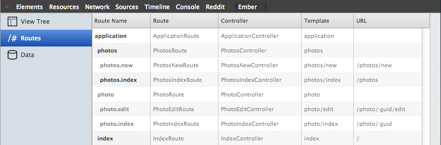
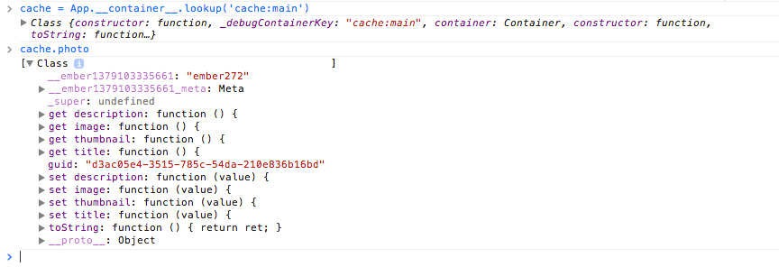

<span id="introduction"></span>*Ember Data* is one of the most ambitious undertakings in recent JavaScript history. It carries the promise of a persistance library that makes it easy to build large browser applications that interact with diverse APIs. *Ember Data* is evolving quickly as the Ember Core Team experiments and iterates the library to create a generalized solution that will work for many use cases. These changes introduce code with kinks that haven't been ironed out yet. When using *Ember Data* developers often find themselves digging into the library to look where the problem originates.

Digging into *Ember Data* source code is easier for experienced Ember developers who are familiar with *Ember Data*'s history and Ember community. For a beginner, who is building a small browser app this can be extremely frustrating because its difficult to find the source of the problem. Innevitably, beginners waste days trying to figure out how to get their apps to make simple requests to their non conventional APIs. 

This article was written as an alternative to that experience. The goal of this article is to help you undestand Ember architecture and allow you to buid simple apps without relying on *Ember Data*.

There will come a day when *Ember Data* is a rock solid library that is easier to use than writing your own AJAX requests. Until that day, learn Ember architecture and roll your own persistance layer. This will give you the added bonus of understanding how *Ember Data* ties into *Ember* and what problems it tries to solve for you. 

<span id="application"></span>
### Application

The Ember CRUD Example app does basic CRUD functionality and stores the created entries in HTML5 localStorage. This app is **work in progress** and I intend to improve it over time. You can checkout the <a href="https://github.com/taras/ember-crud-example#todo" target="_blank">TODOs</a> to see what's completed.

<div class="btn-group mbl mtm"><a href="app/" class="btn btn-success">Try the app</a><a href="app/tests/" class="btn btn-info">Run tests</a><a class="btn btn-warning" href="https://github.com/taras/ember-crud-example#todo" target="_blank">TODOs</a></div>

Create an app instance and configure it to log information 

```
// log binding activities
Ember.LOG_BINDINGS = true;

var App = Ember.Application.create({
  // log when Ember generates a controller or a route from a generic class
  LOG_ACTIVE_GENERATION: true,
  // log when Ember looks up a template or a view
  LOG_VIEW_LOOKUPS: true, 
  // render the application in jQuery("#ember-crud-example")
  rootElement: "#ember-crud-example"
});
```

<span id="routes"></span>
### Routes

<div class="dialog dialog-info">If you're not sure where to start planning your application, start with routes.</div>

Routes are the entry point to your application. The example app allows the user to upload photos and add title and description to each photo. So we start with urls where the user will be perform these actions.

* **/photos/** - show a list of photos
* **/photos/new** - create a new photo
* **/photo/:id** - see an existing photo
* **/photo/:id/edit** - edit an existing photo
* **/** - root of the application


Ember has two different kinds of routes: resources and nested routes. Resources can nest other resources and routes, and are added with ```this.resource( name, options, fn )```. In the example app, **photos** and **photo** are resources. Nested routes are nested into resources and are added with ```this.route( name, options )```. Nested resources **can not** have other resources or endpoints under them. 

Ember's class naming conventions can be tricky especially around the route class names. If you're not sure what class name Ember expects, open Route tab in the Ember Inspector. 



#### ApplicationRoute

**ApplicationRoute** is the brain of the example app. It listens for important events that happen in the application and handles them appropriately.

<div class="dialog dialog-info">When starting, handle actions in the application route. Later, when you need more granular control, you can refactor your app to handle them deeper in your app.</div>

In the example app, all actions are handled in **/app/routes/application.js**. **ApplicationRoute** is also responsible for handling transitions from one route to another.

If you look at the **actions** property in **ApplicationRoute**, you can get a birds eye view of all of the actions that are handled by this application. **edit**, **create**, **update** and **remove** are the CRUD operations. They're responsible for updating the persistence layer. I created a simple HTML5 localStorage based persistence layer with a simple API to make it clearer what happens when the CRUD operations are performed.

Ember expects nested routes to be rendered inside of its resource's template. This means that when accessing a nested route, by default, both the resource template and the nested route template are rendered.

<div class="dialog dialog-warning">Nested templates are rendered into an ```{{outlet}}``` in the resource's template. If the resource's template doesn't have an ```{{outlet}}``` then the nested route's template will **not be** rendered.</div>

#### IndexRoute

**IndexRoute**, located in **/app/routes/index.js**, is displayed when the user accesses the root url of the application(ie. **/**). In the example app, we want to redirect the users to the **PhotosRoute**, so we call ```this.transitionTo('photos')``` in **beforeModel** hook.

<div class="dialog dialog-info">Routes have 3 model related hooks that you can use to transition to other routes and handle validation. **beforeModel** is called before the route queries for models. **model** must return the model or models that will be bound to the controller. **afterModel** can be used to perform transitions after models were resolved.</div>

#### PhotosRoute

**PhotosRoute**(in **/app/routes/photos.js**) shows a list of uploaded photos and nests **NewPhotosRoute**(in **/app/routes/photos/new.js**).

In the example app, we want to show the new photo form when on the **NewPhotosRoute** or list of photos when on the **PhotosRoute**. This means that the **PhotosRoute** exists in 2 states: the list or the form. The template for **PhotosRoute**, located in **/app/templates/photos.hbs** has ```{{if isOpenNew}}``` is true then show ```{{outlet}}```, otherwise show the list. 

<span id="models"></span>
### Models

<div class="dialog dialog-info">*Ember Data* provides **Ember.Model** but that doesn't mean that Ember requires *Ember Data*.</div>

In Ember world, *model* has several meanings. Lower case *model* refers to an object that contains data that's presented in the template. It's used this way in the **Ember.Route** where the route must handle data that will be bound to the controller and the template. Capital case *Model* refers to the class that you would extend to define model types for your application. Usually, the persistence library will provide this class for you.

In the example app, I created a persistence library that uses *HTML5 localStorage* and it provides a **Model** class, located in **/app/models/index.js**. **Photo** class, located in **/app/models/photo.js**, extends **Model** class.

<span id="controllers"></span>
### Controllers

Controllers are the glue between the route and the template. The route is responsible for setting up the controller using the **setupController** hook. *Ember Data* automatically sets the return value of route's **model** hook to the controller's **content** property. The template is bound to the controller which allows you to define custom properties that are available in the template. You can also bind the **content** property to any other object that you can access via ```this.get(path)``` within the controller. 

In the example app, I wanted to show a list of photos in the **PhotosRoute**, I could have used the route's **setupController** to set the **content** property on the **PhotosController** , but that would only show photos that were loaded when the route was first rendered. I wanted the list to update automatically when items are added or removed, so I bound the content property to the list of photos in the persistence layer using path **storage.cache.photo**. Look in **/app/controllers/photos.js** to see how this is done.

<span id="persistence-layer"></span>
### Persistence Layer

The persistence library that I created is like training wheels for your app. Its just enough to work and provide a CRUD like API for storing records in localStorage. The library is located in **/app/utils/local-storage.js**.

This persistance layer creates a singleton cache object that has as properties objects that are stored in localStorage. Essentially, for every item in localStorage, the persistance layer has an object in the cache.

<div class="dialog dialog-info">You can inspect the cache in Chrome DevTools Console by running ```cache = App.__container__.lookup('cache:main')```.</div>

The library has a few methods that are helpful to know when playing around with the code. 

* ```this.storage.create( model )``` - stores a newly created model in localStorage
* ```this.storage.read( modelClass, guid )``` - retrieve a model of specific class and guid from localStorage
* ```this.storage.update( model )``` - update model in localStorage
* ```this.storage.remove( model )``` - remove model from localStorage ( instead of delete, because delete is a reserved keyword )
* ```this.storage.findAll( modelClass )``` - return array of all objects of given class
* ```this.storage.refresh( modelClass )``` - you only need to call this if you need to force the cache to update

Storage object is injected into every route and controller and is available using ```this.storage```.

<span id="injections"></span>
### Injections

<span id="start"></span>
### Get the code

<div class="dialog dialog-info">The example app is based on *Ember App Kit*. Read <a href="/articles/introduction-to-ember-app-kit">introduction to Ember App Kit</a> if you're not familiar with the tools that it provides.</div>

1. fork the [Ember CRUD Example](https://github.com/taras/ember-crud-example) repository on GitHub
2. clone your fork to your computer
3. in your working directory
  1. install Node.js modules with ```npm install``` ( assuming you have npm installed, if not [Introduction to npm](http://howtonode.org/introduction-to-npm) )
  2. install Bower components with ```bower install``` ( assuming you have bower installed, if not ```npm install -g bower```)
  3. install Grunt with ```npm install -g grunt-cli``` if you don't already have it installed
4. Verify that everything works
  1. start the dev server with ```grunt server```
  2. go to <a href="http://localhost:8000" target="_blank">http://localhost:8000</a>
  3. your app should look like the <a href="app/index.html">demo</a>